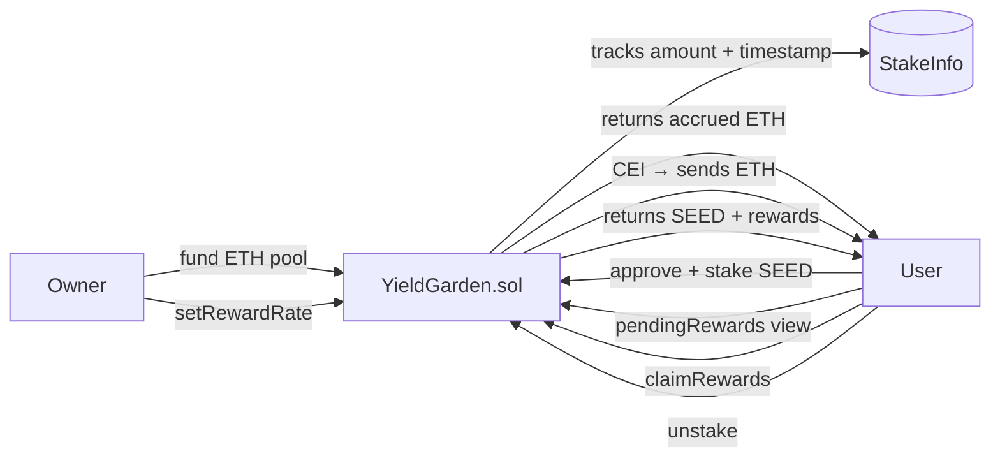

# YieldGarden — Stake SEED tokens, earn ETH rewards per second

> Stake any amount of SEED tokens. The longer you hold, the more ETH you earn — rewards accrue every second, proportional to your stake.


🔗 **Live demo:** https://yield-garden-b7.netlify.app
📜 **Contracts (Sepolia):** [SeedToken](https://sepolia.etherscan.io/address/0x453B8a25f249E35838444A429A7384c4a6087f79) · [YieldGarden](https://sepolia.etherscan.io/address/0xEC53a51c83b9cC5372312EEaAE0d5BE3193F4b60)

---

## What it does

- Users **stake SEED tokens** (any amount) into the garden.
- **ETH rewards accrue every second**, proportional to the staked amount and time.
- Users can **check pending rewards** without spending gas via `pendingRewards()`.
- Users can **claim rewards** at any time without unstaking.
- Or they can **unstake** and receive tokens + accumulated rewards in one transaction.
- The owner **funds the reward pool** by sending ETH to the contract and can update the reward rate.

## How it works



## Tech stack

| Layer | Tech |
|-------|------|
| Smart contracts | Solidity 0.8.24 (SeedToken + YieldGarden) |
| Standards | OpenZeppelin ERC20, Ownable |
| Dev / testing | Foundry (forge, anvil) + fuzz testing |
| Frontend | Next.js + wagmi + viem + RainbowKit |
| Network | Ethereum Sepolia testnet |

## Key design decisions

**Rate expressed as wei per whole token per second**
The rate divides by `1e18` so the owner can set human-readable values (e.g., `1 = 1 wei reward per 1 SEED per second`). This avoids the scale mismatch between ERC20 token units (18 decimals) and ETH wei.

**`pendingRewards()` view function**
Users can preview exactly how much ETH they've earned before deciding to claim or unstake. Same UX pattern as DeFi vaults (ERC-4626 `previewWithdraw`).

**`stakedAt` reset on claim (checkpoint model)**
Instead of tracking cumulative debt, we reset the `stakedAt` timestamp to `block.timestamp` on each claim. Simple, gas-efficient, and avoids integer overflow in long-running staking positions.

**CEI pattern throughout**
State is cleared before all ETH transfers in both `claimRewards` and `unstake` — a malicious receiver cannot re-enter and double-claim rewards.

## Testing ⭐

```bash
forge test -vvv
```

20 tests covering:
- ✅ Stake records amount and timestamp
- ✅ Reverts: zero amount, already staking
- ✅ `pendingRewards` returns 0 before staking
- ✅ Rewards accrue linearly over time
- ✅ Rewards proportional to staked amount
- ✅ `claimRewards` sends correct ETH
- ✅ `claimRewards` resets accrual checkpoint
- ✅ Reverts: no rewards yet, not staking, insufficient pool
- ✅ `unstake` returns tokens and pays pending rewards
- ✅ `unstake` clears state correctly
- ✅ Owner can update reward rate
- ✅ Non-owner cannot update rate
- ✅ **Fuzz:** 1000 random time durations — rewards always linear

## Run locally

```bash
forge build
forge test -vvv

cp .env.example .env
# fill in SEPOLIA_RPC_URL and PRIVATE_KEY
source .env && forge script script/Deploy.s.sol \
  --rpc-url $SEPOLIA_RPC_URL --private-key $PRIVATE_KEY --broadcast
```

## What I learned

The hardest part was the decimal mismatch: ERC20 tokens have 18 decimals, so staking `100 tokens` means `100e18 units`. Without dividing by `1e18` in the reward formula, the math overflows and the reward pool drains instantly. This is a real bug in production protocols — most DeFi staking contracts normalize amounts before computing rates. The `stakedAt` checkpoint model also taught me that you don't always need complex debt accounting — resetting a timestamp is often enough to track incremental claims.

---

## Contact

**Armando Ochoa** · Smart Contract Developer
📧 armaochoa99@gmail.com · Open to Web3 opportunities.

> Built as part of my blockchain developer journey.
